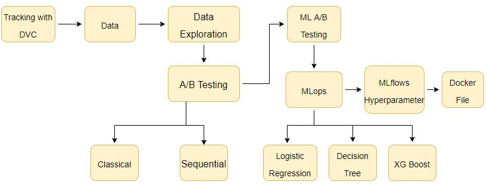
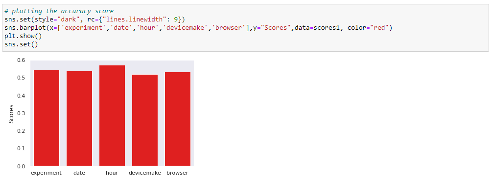

<!-- Articles: [Medium Article](https://medium.com/@amdeamd7/a-b-test-with-machine-learning-2a3b4ed23487) -->

---
# SmartAd-abTest


---
The main objective of this project is to evaluate if the ads that smartAd company runs resulted in a significant lift in brand awareness. 
You can read more from: [Medium Article](https://medium.com/@amdeamd7/a-b-test-with-machine-learning-2a3b4ed23487)

In this git We will cover:

    Setting up  classical & sequencial A/B tesing framework.
    Extracting statistically valid insights in relation to the business objective.
    Draw conclusion based on the satistical insights.
    

## Data & Background
- You can download the data for this project from [here](https://drive.google.com/file/d/1wZwpTspjw9iE-ByzSFdqem_BXD_yf4uw/view?usp=sharing)
    Q: Do you know the brand Lux?

- The BIO data for this project is a “Yes” and “No” response, of online users on the  question.
    Q: Do you know the brand Lux?

        O Yes
        O No

- Two types of user were using for the experiment, control & expose

    Control: users who have been shown a dummy ad

    Exposed: users who have been shown a creative (ad) that was designed by SmartAd for the client.

Control group engagment analysis

Expose group engagment analysis

 P and t value for the groups


## Conclusion

* Since the p-value is 0.5185 > alpha(0.05), We fail to reject the null hypothesis H0.
* So we came to the conclusion that there is no statistically significant difference between the two campaigns.

## A/B TESTING WITH MACHINE LEARNING

mlops workflow


With A/B testing we compare between two, but with machine learning we can incorporate
the complexity and dynamic nature of data and draw insights.

Using k-fold cross validation we were able to train
three different models and determine their
accuracy in predicting our data.

### MEAN PERFORMANCE OF THE MODELS

accuracy score


#### Accuracy Scores

* Desicion Tree: 0.464
* Logistic Regression: 0.536
* XGBoost: 0.536
* Random Forest: 0.528
#### Best Models

* 1 - XGBoost
* 2 - Logistic Regression
* 3 - Random Forest

mlflow run

# Classical A/B test vs Machine learning

With classical A/B testing, we determined if there was a significant lift in brand awareness which is instrumental to smartAd in making the next move.

With Machine Learning, we discover that the other features like the hour of the day, and the dates, determine the conversion in brand awareness.

**There is a greater potential to have a significant lift in brand awareness.**


# Setup

## Installation

```bash
git clone https://github.com/Amdework21/SmartAd-abTest.git
cd smartAd-abTest
pip install python3 setup.py
```

---

## contributors


Made with [contrib.rocks](https://contrib.rocks)